<a href="https://wes-chen.github.io/build-a-website/">Return to course home</a>

# Install Atom.

If you want to be a proper web developer, then you should be using a proper text editor - not Notepad and not TextEdit.

Atom is a "hackable" text editor for the 21st Century, and it is the text editor of choice not only for us, but for many computer programmers all over the world.

Let's check if you have Atom already installed on your computer.

*For Windows*:
1. Click the search button in the bottom-left of the menu bar.
2. Enter "Atom".
3. If you have Atom installed, then you should be able to see a green atom icon. That's Atom! 
4. If you do not have Atom installed, then you should not be able to find this green atom icon. From here, you will have to download it using the link below.

*For Mac*:
1. Click the magnifying glass in the upper-right corner, or press `Command + SPACE`.
2. Enter "Atom".
3. If you have Atom installed, then you should be able to see a green atom icon. That's Atom! 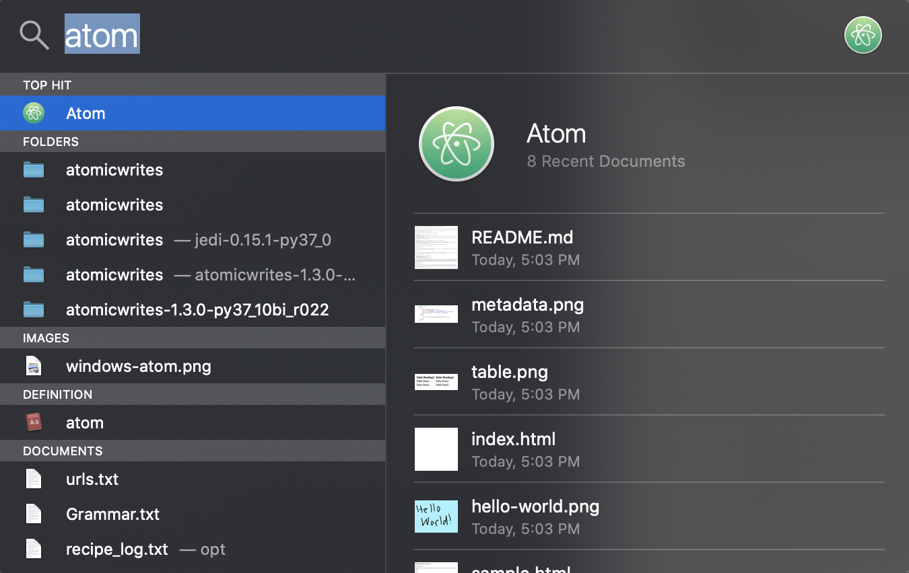
4. If you do not have Atom installed, then you should not be able to find this green atom icon. From here, you will have to download it using the link below.

[Please click here to download the Atom installer.](https://atom.io/){:target="_blank"}

Once we have Atom installed, let's continue learning!

# Recap from last time

Some of you may be confused after speeding through the first two lessons of our _build-a-website_ program. To assist in your learning, here is a summary of what you learned:

### Git

Git is a system that keeps a history of any changes to files - it can help you determine exactly _what_ files changed, _when_ they were changed, _who_ changed them, and the reasons _why_ they were changed.

There are a bunch of uses for Git, such as:

-   Viewing the history of the entire project
-   Adding or modifying files
-   Creating your own branch to work on
-   Merging your own branch into the main branch

For the purpose of our program, you will be using Git to [commit](https://www.git-tower.com/learn/git/commands/git-commit){:target="_blank"} (or highlight) any changes we make to your website to your local repository (the folder that is on your computer), then to [push](https://www.atlassian.com/git/tutorials/syncing/git-push){:target="_blank"} those changes from your local respository to your remote GitHub repository (copying your files from your computer folder to the folder on GitHub)

#### Repository

A Git repository is actually the `.git/` folder inside your project area (which is the folder that contains all the files for your website). This repository tracks all changes made to the files in your project, thus building a history over time. This means that if you delete the `.git/` folder, then you lose your entire history of changes (so please don't delete the `.git/` file).

For the sake of this program's simplicity, when you hear the term "commit", think of it as the process of writing down your current file changes to a growing list of file changes - this growing list is your Git repository, thus you "commit" your current files into the repository. Likewise, when you hear the term "push", think of it as copying your current files and its change history to your online GitHub folder, thus you would "push" everything in your `.git/` folder to your online GitHub repository.

You might also hear the term "fetch" which means to download commits, files, and refs from a remote (or online) repository into your local repository (the folder on your computer). You will probably only use this command if you end up switching computers from your previous computer, and you need to download your website files to this new computer.

### GitHub

[Github](https://github.com){:target="_blank"} is a website that helps us developers store and manage our code. [Google search results](https://www.google.com/search?source=hp&ei=_LGfXfamA8Xv9AP4zo34Cw&q=what+is+github&oq=what+is+github&gs_l=psy-ab.3..0l10.533.1776..2337...0.0..3.289.2927.1j5j8......0....1..gws-wiz.......0i131.m6aMxyvB8is&ved=0ahUKEwj2lNGM4JLlAhXFN30KHXhnA78Q4dUDCAg&uact=5){:target="_blank"} can give us more insight into what Github is. Some features that Github provide for developers make it really easy for us to do pretty cool things, like [using Git commands without knowing any command line interface](https://desktop.github.com/){:target="_blank"} or [have our own website hosted online for free](https://pages.github.com/){:target="_blank"}!

For this purpose of this program, GitHub will be holding your online repository in which you push your project changes to.

### GitHub Desktop

GitHub Desktop makes it easy for us to do many of the common Git command with the click of a few buttons! For most of this program, you will be using GitHub Desktop to commit and push your website changes to your online GitHub repository!

### GitHub Pages

GitHub has a really awesome feature where you can host your own website FOR FREE! All you need to do is create a repository named [your username here].github.io and it'll automatically host your website at [your username].github.io. It is pretty nifty, and it doesn't cost a dime!

You will be hosting your website using GitHub Pages, and this webpage is automatically set-up through the repository name ([your username here].github.io)!

### index.html

The `index.html` page is the most common name used for the default page shown on your website if no other page is specified when a visitor visits your website. In other words, `index.html` is the name used for the homepage of your website.

Last time, we made you create and edit an `index.html` file that is placed into your `[username].github.io` repository (both local and online). For the start of this program, if you want to make any changes to your preliminary website, then you will make those respective changes to the `index.html` file.

# HTML

Hopefully you have an idea of what is going on so far with this program. Hence, to start the foundation of your website, we will be teaching you how to learn and use HTML!

## What is HTML?

HTML stands for Hypertext Markup Language. HTML describes the basic structure of a web page semantically. In other words, it conveys how to render the graphics of a web page to the browser. For this lesson, the browser will read your code inside the `index.html`, and your browser will begin to have a basic structure to it!

Learning HTML is the first step in creating websites, combined with JavaScript and CSS you will be able to create aesthetically pleasing and functional websites. JavaScript and CSS is something that can be learned at another time. For now, let's focus on how to add basic content on a page, like text and images!

## HTML: Basics

### Anatomy
Every HTML element is comprised of:
- Opening tag: the first HTML tag that contains the element name, surrounded by ` < ` and ` > `.
- Content: the information contained betwen the opening and closing tags.
- Closing tag: the second HTML tag that contains the element name, surrounded by ` </ ` and `>`.

### Essential HTML Elements

- **&lt;p&gt;Hello World!&lt;/p&gt;**  
`p` stands for "paragraph" and will be your bread and butter element.
The example paragraph element above will be read by the browser as a paragraph element, thus the "Hello World!" text will be displayed in a paragraph.

- **&lt;h_&gt;Heading&lt;/h_&gt;**  
`h_` is a heading element, replace `_` with a number between 1 and 7 to choose the size of the heading, being that 1 is the largest and 7 is the smallest.
For example, writing `<h1>Topic</h1>` in your `index.html` file will display a huge text saying Topic.

- **&lt;a href="/"&gt;Link&lt;/a&gt;**  
`a` stands for "anchor", and it is used to redirect the user to another location in the same or other web pages. "href" is how you reference the redirect of the user in which you can put a local path here or perhaps an entire web URL.
For example, writing `<a href="https://www.google.com/">Click me for help!</a>` in your `index.html` file will display a clickable text saying "Click me for help!" that when someone clicks on that that text, it will change the current webpage to Google's homepage.

## PRE-CHALLENGE #01: Do you have an `index.html`?

We mentioned an `index.html` file earlier - but do you actually know if you have that file for your website?

Let's go ahead and search for our `index.html` file.

*For Windows*:
1. Click the search button in the bottom-left of the menu bar.
2. Enter "File Explorer", then click it.

3. Click on `Documents -> GitHub -> [username].github.io`. This should lead you to your website folder. Inside the folder, you might have a `README.md`, an `index.html`, or perhaps nothing at all. If you DO have an `index.html`, then you are set! Otherwise, **if you DO NOT have an `index.html`, then go to step 4**. For example, my folder looks like this:
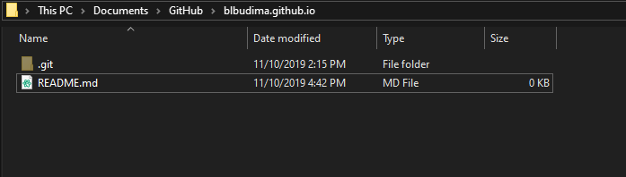
Since I do not have an `index.html`, I will need to add it.
4. To add an `index.html` file to your folder, **please right-click the link [here](index_html_file/index.html) and select `Save as...`**.
5. Go ahead and save the `index.html` file to location of your website folder (e.g. `Documents -> GitHub -> [username].github.io`).

6. Your website folder should look like this now:

7. Go ahead and open this website folder in Atom by opening up Atom, click `File -> Add Project Folder...`, then navigate to your project folder (e.g. `Documents -> GitHub -> [username].github.io`)

8. You should see your project folder on the left column of your Atom! Double-click your `index.html` to edit it! 

*For Mac*:
1. 1. Click the magnifying glass in the upper-right corner, or press `Command + SPACE`.
2. Enter "Finder", then click it.
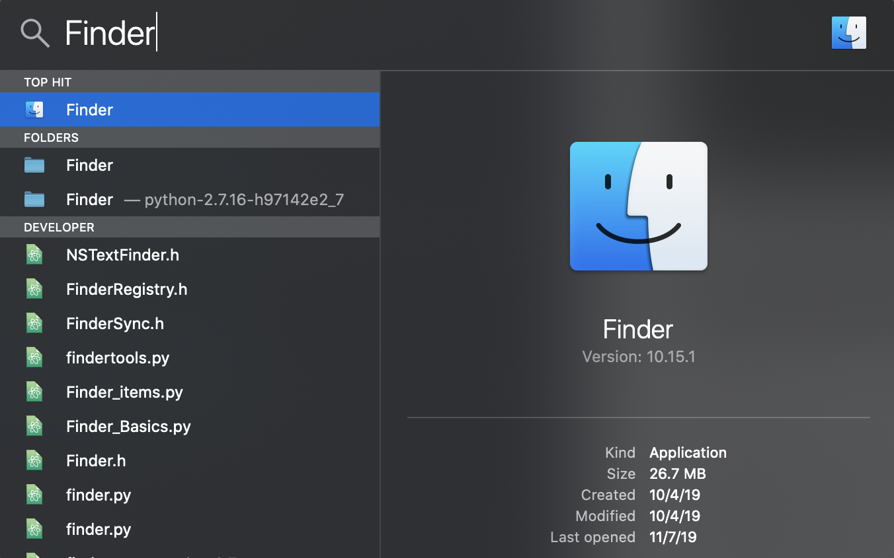
3. Click on `Documents -> GitHub -> [username].github.io`. This should lead you to your website folder. Inside the folder, you might have a `README.md`, an `index.html`, or perhaps nothing at all. If you DO have an `index.html`, then you are set! Otherwise, **if you DO NOT have an `index.html`, then go to step 4**. For example, my folder looks like this:

Since I do not have an `index.html`, I will need to add it.
4. To add an `index.html` file to your folder, **please right-click the link [here](index_html_file/index.html) and select `Save as...`**.
5. Go ahead and save the `index.html` file to location of your website folder (e.g. `Documents -> GitHub -> [username].github.io`).

6. Your website folder should look like this now:

7. Go ahead and open this website folder in Atom by opening up Atom, click `File -> Add Project Folder...`, then navigate to your project folder (e.g. `Documents -> GitHub -> [username].github.io`)

8. You should see your project folder on the left column of your Atom! Double-click your `index.html` to edit it! 

## CHALLENGE #01: The beginnings!
Let's try adding these three HTML elements to your website! Go ahead and clear our your `index.html` file, then edit your `index.html` file so that you insert these items:

- a large heading element that says "Name"
- a paragraph element that says your name
- a smaller heading element that says "Description"
- a paragraph element that contains a short description about you
- an anchor element saying "Click me!" that redirects the user to your GitHub profile

**Here are some hints to remember**:

- `index.html` can be located on your computer in your `Documents/GitHub/[username].github.io/ folder`.
- Once you make your changes, don't forget to SAVE your `index.html` file. This can be done by clicking `File->Save` or by pressing `CTRL + S` for Windows or `Command + S` for Mac at the same time.
- In order to check your changes, open up your GitHub Desktop (the app with the purple background), click `Commit to master` on the bottom-left, then click `Push origin` on the top bar. Afterwards, open up a web browser and put in your website (e.g `[username].github.io`) in the URL, and it should load!
- Don't forget to use Google to your advantage!

**Here are some steps to get you started**:

1. Once you open up your `index.html`, let's go ahead and place a large heading element for our name. We will use `<h1>` as our heading size. 
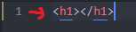
2. Since this large heading element will say "Name", we will put "Name" in between the `<h1>`. 

3. Next, we will have a paragraph that will say our name. The paragraph element is `
`. For example, my name is Benson Budiman, so I will put "Benson Budiman". 
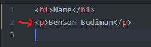
4. Let's go ahead and place a smaller heading element that says "Description". We will use `<h4>` as our heading size. 
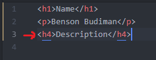
5. Next, we will have a paragraph that will say a short description about me. The paragraph element is `
`. For example, I am a UCSD student, so I will put that "I am a UCSD student." 
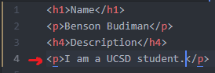
6. Finally, we will have an anchor element that says "Click me!" that redirects the user to my GitHub profile. Make sure to replace the link with your own profile link! 

Here is an example of a small website that includes these three HTML elements:

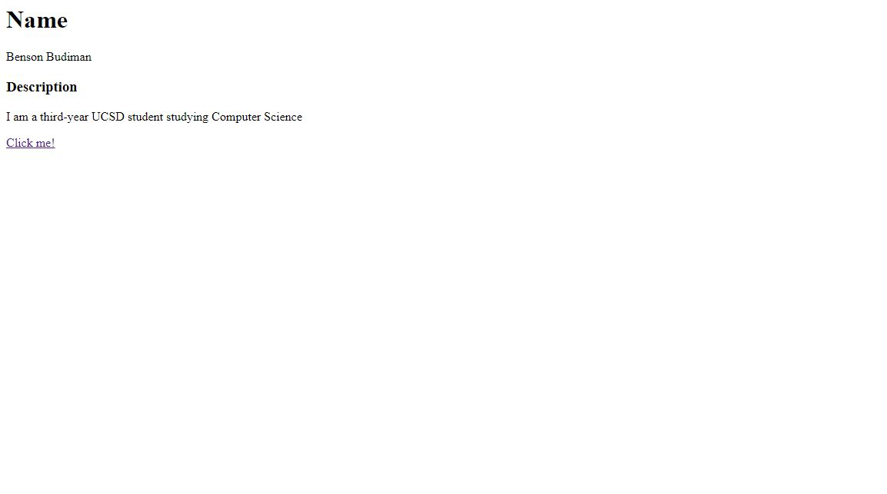

### More Essential HTML Elements

- **&lt;button&gt;Click Me!&lt;/button&gt;**  
As the name suggests, this element creates a clickable button.
The example above will display a button that says "Click Me!" within it.

- **&lt;img src="blank"/&gt;**  
`img` stands for "image". This element is used to embed (or place) images in the webpage. You can replace `blank` with the link to the image you want to display.
**IMPORTANT**: Note how this element comprises of only one tag (there is no `</img>` at the end of the line). The image tag is part of a family of HTML tag exceptions that only require one tag. This is called a self-closing tag as we can simply close out a beginning tag by using the "/" character.
For example, typing `` will display a picture of a cat on your webpage!

- **&lt;br/&gt;**  
`br` stands for "line break". This element adds a new line after the previous element. It's functionality is similar to the "Enter" key on the keyboard. You can use this element to create larger white-spaces between text or images in your webpage.

- **&lt;div&gt; ... &lt;/div&gt;**  
`div` stands for "division" (or section) in an HTML document. The `div` element is often used as a container to hold other HTML elements to style them with CSS or to perform certain tasks with JavaScript. For this lesson, `div` is not as important, but you should not forget about it - it will come back!

- **&lt;span&gt; ... &lt;/span&gt;**  
`span` can be used to style certain elements within its tags.
For example, typing `
This is blue.
` will display the following:

For this lesson, `span` is not as important because we will not cover any styling features, but you should not forget about it as well! It will come back next lesson.

## CHALLENGE #02: Let's add a little more!
Let's try adding more three HTML elements to your website! Go ahead and edit your `index.html` file so that you insert these items to the bottom of what you currently have:

- a button that says "Click me!"
- am image of a dog
- an image of a cat
- two line breaks between the paragraph element of your name and the heading element of "Description"
- one line break between the anchor element and the button element
- one line break between the button element and the image element of a dog
- one line break between the image element of a dog and the image element of a cat

**Here are some hints to remember**:

- `index.html` can be located on your computer in your `Documents/GitHub/[username].github.io/` folder.
- Once you make your changes, don't forget to SAVE your `index.html` file. This can be done by clicking `File->Save` or by pressing `CTRL + S` for Windows or `Command + S` for Mac at the same time.
- In order to check your changes, open up your GitHub Desktop (the app with the purple background), click `Commit to master` on the bottom-left, then click `Push origin` on the top bar. Afterwards, open up a web browser and put in your website (e.g `[username].github.io`) in the URL, and it should load!
- Don't forget to use Google to your advantage!

**Here are some steps to get you started**:

1. Once you open up your `index.html`, let's go ahead and place that button that says "Click me!".

2. Let's place an image of a dog! [Here](https://boygeniusreport.files.wordpress.com/2016/11/puppy-dog.jpg?quality=98&strip=all&w=782) is an image of a dog that you can use. Go ahead and click `Here`, and then use its URL link for your dog image!

3. Let's place an image of a cat! [Here](https://timesofindia.indiatimes.com/thumb/msid-67586673,width-800,height-600,resizemode-4/67586673.jpg) is an image of a cat that you can use. Go ahead and click `Here`, and then use its URL link for your cat image!
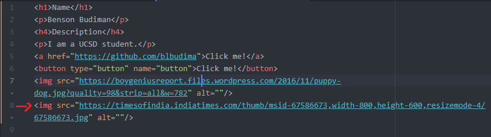
4. Let's put two line breaks between the paragraph element of your name and the heading element of "Description".

5. Let's put the final three line breaks - one line break between the anchor element and the button element, one line break between the button element and the image element of a dog, and one line break between the image element of a dog and the image element of a cat.

Here is an example of a small website that includes these added HTML elements:

### Slightly more complex Elements

- **&lt;ul&gt; ... &lt;/ul&gt;    and     &lt;ol&gt; ... &lt;/ol&gt;**  
These are HTML list elements. `ul` creates an **unordered** list while `ol` creates an **ordered** list.  
`li` which stands for "list item", is used to add items to the lists.

Ex: 
&lt;ol&gt;  
 &nbsp;&nbsp;&lt;li&gt; This &lt;/li&gt; 
 &nbsp;&nbsp;&lt;li&gt; is &lt;/li&gt; 
 &nbsp;&nbsp;&lt;li&gt; an &lt;/li&gt; 
 &nbsp;&nbsp;&lt;li&gt; ordered &lt;/li&gt; 
 &nbsp;&nbsp;&lt;li&gt; list. &lt;/li&gt; 
&lt;/ol&gt; 

Output:

1) This

2) is

3) an

4) ordered

5) list.

 

- **&lt;table&gt; ... &lt;/table&gt;**  
As the name suggests, this element is used to create table elements.  

Ex: 
&lt;table&gt;  
 &nbsp;&nbsp;&lt;tr&gt;  
 &nbsp;&nbsp;&nbsp;&nbsp;&lt;th&gt; Table Heading1 &lt;/th&gt; 
 &nbsp;&nbsp;&nbsp;&nbsp;&lt;th&gt; Table Heading2 &lt;/th&gt; 
 &nbsp;&nbsp;&lt;/tr&gt; 
 &nbsp;&nbsp;&lt;tr&gt;  
 &nbsp;&nbsp;&nbsp;&nbsp;&lt;td&gt; Table Data1 &lt;/td&gt; 
 &nbsp;&nbsp;&nbsp;&nbsp;&lt;td&gt; Table Data2 &lt;/td&gt; 
 &nbsp;&nbsp;&lt;/tr&gt; 
 &nbsp;&nbsp;&lt;tr&gt;  
 &nbsp;&nbsp;&nbsp;&nbsp;&lt;td&gt; Table Data1 &lt;/td&gt; 
 &nbsp;&nbsp;&nbsp;&nbsp;&lt;td&gt; Table Data2 &lt;/td&gt; 
 &nbsp;&nbsp;&lt;/tr&gt; 
&lt;/table&gt; 

Output:  

**SO MANY TAGS!!** Let's examine them one by one:
  - `tr` stands for table row, this is used to add a row to the table, this element contains all the data in each row.
  - `th` stands for table heading, this is used in the first row of each table for the heading, the content is **bold** by default.
  - `td` stands for table data, this is used to add data in the table.

## How to set up a proper HTML file

Professional HTML files have much more than just a body element containing the different HTML elements. They have an element hierarchy and most important of all they contain **metadata** (data about data) that tells the browser how to display your web page.

### Hierarchy
- `<!DOCTYPE html>`: this is the first line of code inside a HTML file, it tells the browser that the file should be interpreted as a HTML file.

- The `html` element is the great-great-great-...-grandparent of all HTML elements and it's the **outermost** element in a HTML file. This is used to tell the browser that the contents inside the tags are proper HTML elements.

- The `head` element contains the metadata we mentioned before. Anything inside the `head` tag will not be displayed on the web page. This tag should be inside the `html` tag and outside the `body` tag.

- The `body` element contains all the other elements that you want to display on the web page. This tag should be inside the `html` tag and outside the `head` tag.

Ex: 

### Metadata
The following HTML metadata elements should be declared inside the **`head`** element.
- The `title` element defines the title of the document and also the title displayed on the browser tab.
- The `style` element defines style information for the HTML page. More on this in the CSS lesson.
- The `link` element is used to link to external CSS style sheets. More on this in the CSS lesson.
- The `meta` element is used to specify author, description, and other metadata.
- The `script` element is used to define client-side JavaScript.
Ex:  
 

## CHALLENGE #03: The finishing touch!

Here is the final challenge. Go ahead and edit your `index.html` file so that you insert these items to the bottom of what you currently have:

- Add the proper metadata to your `index.html`
- Add an unordered list of your favorite food(s)
- Add a table with columns for your friend and their GitHub username

**Here are some hints to remember**:

- `index.html` can be located on your computer in your `Documents/GitHub/[username].github.io/` folder.
- Once you make your changes, don't forget to SAVE your `index.html` file. This can be done by clicking `File->Save` or by pressing `CTRL + S` for Windows or `Command + S` for Mac at the same time.
- In order to check your changes, open up your GitHub Desktop (the app with the purple background), click `Commit to master` on the bottom-left, then click `Push origin` on the top bar. Afterwards, open up a web browser and put in your website (e.g `[username].github.io`) in the URL, and it should load!
- Don't forget to use Google to your advantage!

**Here are some steps to get you started**:

1. Let's first add the proper metadata to your `index.html`. Using the image below, you will want to copy the lines where there are red arrows. The lines without red arrows should be already written from the challenges above, and so those lines should be placed within a `<body>` tag. Make sure your code looks similar in formatting to the image below:
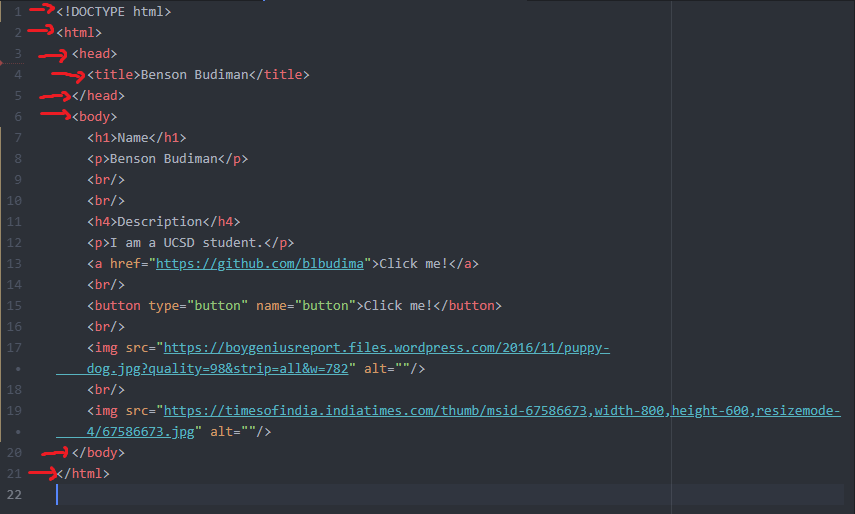
2. Next, let's begin to make our unordered list of favorite foods. We will start by adding the `<ul>` tags to our `index.html`.
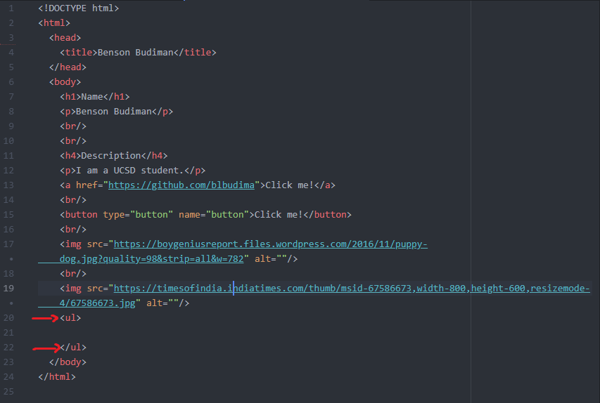
3. My favorite foods are sushi, pizza, and Hot Pockets. I will add my favorite foods as a list item using `<li>`. You should add your own favorite foods - add as many (or as little) as you would like!
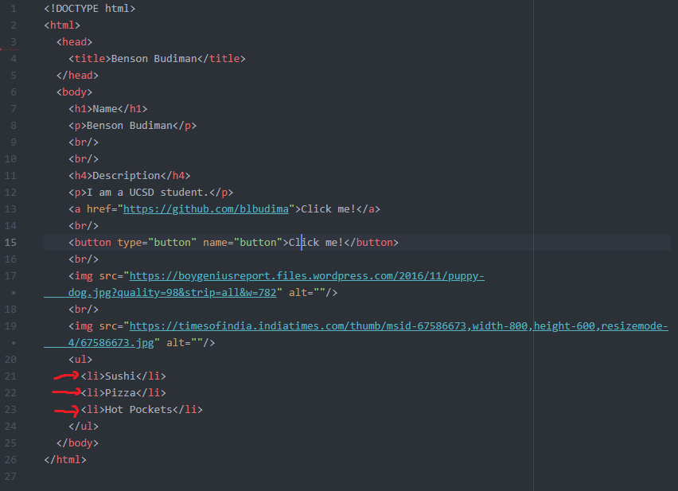
4. Don't forget to say that this is your list of favorite foods!
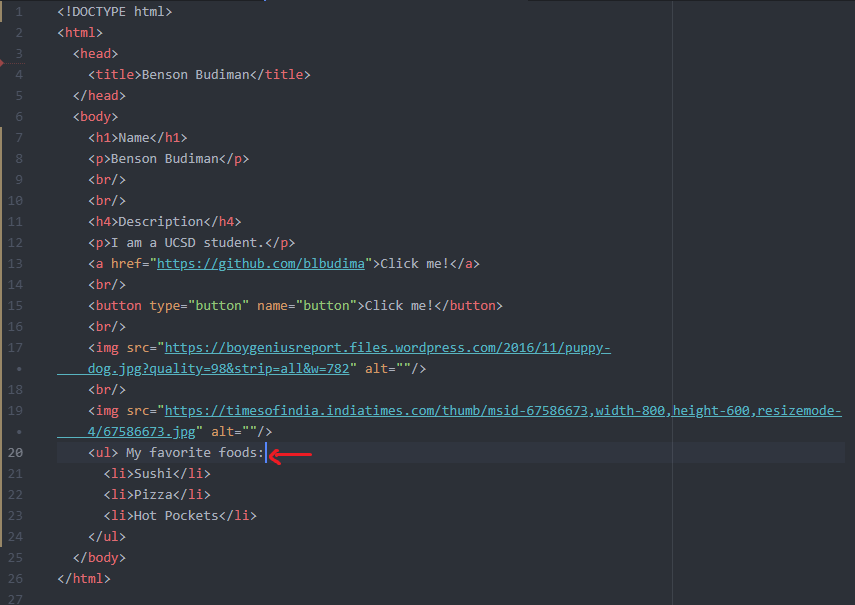
5. Let's start making a table of my friends and their GitHub username! Let's first create a `<table>`. Then, place a `<tr>` (table row) inside the `<table>` and insert two `<th>` (table headers) - `My friends`, and `GitHub username`.

6. Ask some of your friends (or the people next to you) for their name and their GitHub username! Let's say I have `Wesley Chen` as my friend, and his GitHub username is `wes-chen`, and I have another friend named `Jason Cabrera` with his GitHub username being `jayrc7`. For `Wesley Chen`, I would add another `<tr>` (table row), then place two `<td>` for his name and his GitHub username. Likewise, I would do the same for `Jason Cabrera`. Feel free to add as many friends as you would like!
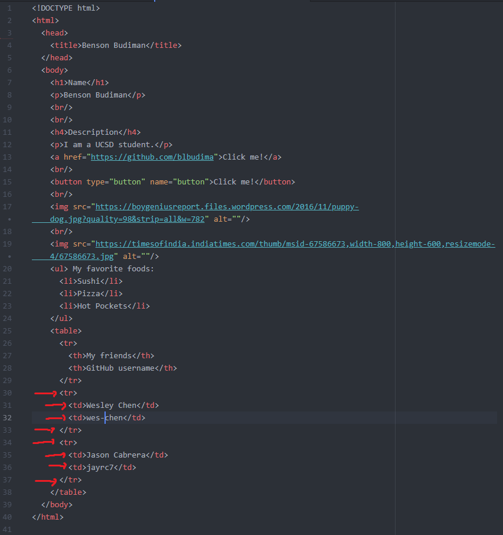

Here is an example of what that includes these added HTML elements look like:

## Final Remarks
[Here](https://wes-chen.github.io/build-a-website/lesson-03/sample.html){:target="_blank"} is an example of more things you could put on your website!

[Codecademy](https://www.codecademy.com/learn){:target="_blank"} does a pretty good job of teaching HTML. Run through [this HTML tutorial](https://www.codecademy.com/learn/learn-html){:target="_blank"} to learn more.

## Next Lesson

For next lesson, we learn about CSS, a styling language used to help our HTML look better. If you would like to get ahead, then please run through this [Codecademy tutorial](https://www.codecademy.com/learn/learn-css){:target="_blank"} at your own pace before the next lesson.

<a href="https://wes-chen.github.io/build-a-website/">Return to course home</a>
