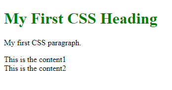
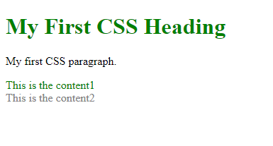
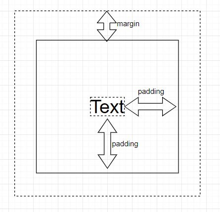
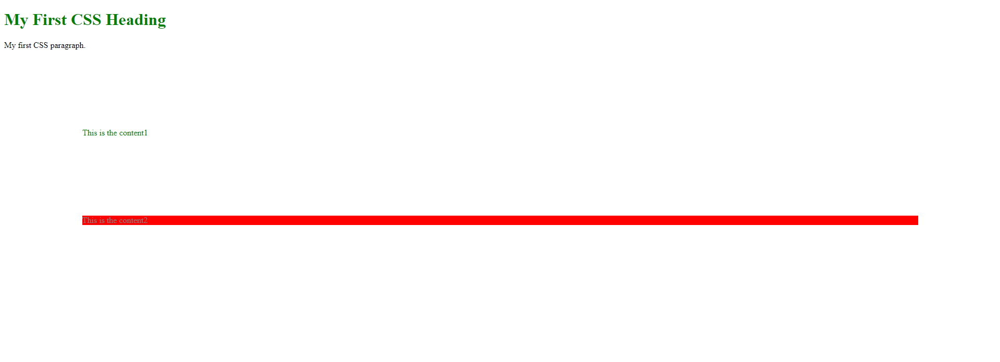

<a href="https://wes-chen.github.io/build-a-website/">Return to course home</a>

# CSS Basics

## A Quick Recap

We learned about several elements last time, and made a cool website with those elements.

In addition to the elements you used last time, two elements we learned last time that are going to really come in handy this time.

### **&lt;div&gt;**

We use `<div>` tags to divide up our html pages into sections.

`<div>` stands for "division" (or section) in an HTML document. The `<div>` element is often used as a container to hold other HTML elements to style them with CSS or to perform certain tasks with JavaScript. As you will learn later, if we add IDs or classes to our divs, we can style specific sections of our page with CSS without affecting the rest of our page.

### **&lt;span&gt;**

We use the `<span>` tag to divide up text into sections, similar to how we use `<div>` This is useful to style only certain parts of our text.

## Some more HTML elements

### **&lt;head&gt;**

This element was briefly covered in last lesson. When we create HTML documents, we include metadata in our `<head>` element. In this lesson, we will include our CSS inside our `<head>` element.

### **&lt;body&gt;**

The `<body>` element contains the content of our website. Last time, we wrote what we would put in our `<body>` element.

## Task

Let's make our webpages that we made last time into proper HTML documents. Please do the following actions:

1. Add a `<HTML>` tag surrounding the the entirety of your `index.html` file.
2. Enclose what you wrote last time in a `<body>` tag.
3. Add `<head> </head>` as the first item in the `<HTML>` tags.

After you finish these tasks, your `index.html` file should look like this:
```html
<HTML>
  <head>
  </head>
  <body>
    ...
    <!-- your content here -->
    ...
  </body>
</HTML>
```

## What is CSS?

CSS stands for Cascading Style Sheets. It describes how HTML elements are to be displayed, and after we create the skeleton for our website using HTML, we write CSS code to make it beautiful.

Without good CSS code the website may look weird.


 So now let's go through examples and dive into CSS!

## CSS: Basics

### Style Tags

Just like html code, like `<h1>title</h1>`, our CSS code is also contained inside a opening tag and a closing tag.

`<style> ...any CSS code you want to write </style>`

Typically, we put our `<style>...</style>` element inside of the `<head></head>` element. By convention, we put anything we want to display like text, paragraphs, and images in the `<body></body>` tag, and we put `<style></style>` in the `<head></head>` element.

```html
<!DOCTYPE html>
<html>
 <head>
  <style>
   p {
    color: black;
   }
  </style>
 </head>

 <body>

  <h1>My First CSS Heading</h1>
  <p>My first CSS paragraph</p>

  <div class="content1">
   This is the content 1.
  </div>

  <div class="content2">
   This is the content 2.
  </div>

 </body>
</html>
```

But, what does the code inside the `<style>` tags actually mean? So let's talk about the basic syntax of the CSS.

### The Basic Syntax

CSS code comprises some basic parts: the selector, the property name, and the value. Let's look at a diagram of it.


-   `p`: This is the <strong>selector</strong> we talked about just now. It means that, we are selecting all the elements with tag `p`. In addition to selecting by the name of the tag, we can also select by id or class, which is covered later in this lesson.

-   `color`: This is the property of the p element that we want to modify. Here, we are saying that, we want to modify the "color" property of all elements with tag p. There are bunch of all other properties that you can use to make more complex modifications.

-   `value`: This is the value that we want to set our color property to. Here we are saying that we want to set the color to red.

It is important that, first, for each line of css code use write, we must put a semicolon `;` at the end. This tells your computer that you have finished one sentence and are beginning the next sentence; second, put all CSS code like `color: red;` inside of curly braces `{...}`.

If your CSS code does not work as intended, for example, the paragraph does not turn red after you set the color to red, it is good to check if you used the syntax correctly.

### CHALLENGE 01: Create your first CSS code!

Before we start making style changes to your main website, we want to make sure you are familiar with the syntax for CSS.

Here is your first task: Given some starter code, make the text inside of `h1` tags green.

To download the starter code, right-click the starter code link below, then select `Save link as...`. Go ahead and download `example.html` anywhere on your computer (BUT NOT INTO YOUR "[username].github.io" REPOSITORY). Once you have downloaded the `example.html`, go ahead and find where it is located, right-click on the file, then select `Open with -> Atom`. You may need to select `Choose another app` to find Atom.

Here is the [starter code](example.html).

Some hints to get you started:
- If you are unsure what all those HTML tags in the `example.html` file are (e.g. `head`, `style`, `body`, `h1`, etc.), you may have to look back to the [previous lesson](https://wes-chen.github.io/build-a-website/lesson-03/){:target="_blank"} to learn what those HTML tags mean.
- Remember to make your styling changes within the `style` HTML tags at the top of the `example.html` file.
- Once you make your changes, don't forget to SAVE your `example.html` file. This can be done by clicking `File->Save` or by pressing `CTRL + S` at the same time.
- In order to check your changes, try double-clicking your `example.html` file to open it in your web browser.
- Don't forget to use Google to your advantage!

Here is an example of what it should look like:



<br/>
<br/>
<br/>

## CSS: Selectors

In the previous section, we used "p" as the selector, so that every p in the page has a color of red. But what if we don't want every paragraph in the page to be red? In order to change one element specifically and without changing others, we use class or id to write CSS code.

### Select element by classes

Classes and ids are both like names: you give an element a name you like, and you select this element by this name. First, you give one element a class:

`<div class="content1">This is the content1</div>`

Write the `class=""` inside the first tag of the element. Notice that you need to put the class inside the quotes.

Then, inside of the `<style>` element, select that class by `.content1`. Notice that here we begin with a dot `.` followed by the class name we just gave to the element we want to select. This is important and necessary.

`.content1 {
   font-size: 20px;
 }`

### Select element by ids

ids and class are both similar, but the most important difference, is the idea that `id` should be unique for each element. For example, each of you is an element, and all of you share one common class: `high-school-students`, but each of you have unique names, or at least unique student IDs. In short, `id` is more specific than `class` and you should use it when you just want to change some particular elements.

`<div id="content2">This is the content2/div>`

Write the `id=""` inside the first tag of the element. Notice that you need to put the id inside the quotes.

Then, inside of the `<style>` element, select that id by `#content1`. Notice that here we begin with a pound `#` followed by the id we just gave to the element we want to select. This step looks similar the what we have for the `class`.

`#content1 {
   font-size: 30px;
 }`

### CHALLENGE 02: Use selectors!

Let's make more changes to styling inside your `example.html` file.

1.  Open up your `example.html` in Atom.
2.  Find two `div` tags inside a single `body` tag.
3.  Give a `class` of `content1` to the first `div`.
4.  Give an `id` of `content2` to the second `div`.
5.  After you assigned a `class` and an `id`, go to the `style` HTML tags.
6.  Make the text in the first `div` green.
7.  Make the text in the second `div` gray.

Some hints to get you started:
- If you are unsure what all those HTML tags in the `example.html` file are (e.g. `head`, `style`, `body`, `h1`, etc.), you may have to look back to the [previous lesson](https://wes-chen.github.io/build-a-website/lesson-03/){:target="_blank"} to learn what those HTML tags mean.
- Remember to make your styling changes within the `style` HTML tags at the top of the `example.html` file.
- `color` will be the property that you want to use.
- When making changes within the `style` HTML tags, `.` is for classes, and `#` is for id's.
- Once you make your changes, don't forget to SAVE your `example.html` file. This can be done by clicking `File->Save` or by pressing `CTRL + S` at the same time.
- In order to check your changes, try double-clicking your `example.html` file to open it in your web browser.
- Don't forget to use Google to your advantage!

Here is an example of what it should look like:



<br/>
<br/>
<br/>

## CSS: More on Styles

Since we have learned how to select different elements, it is time to know more about more properties that we can change in order to make our page look nicer.

### Essential Font Styles

-   color: This determines the color of the text. By default you can see that the color is set to black. You can enter a wide range of colors, such as red, green, gray and so on.</li>
-   font-size: This determines the size of the text</li>
-   font-weight: This determines how thick, or heavy, that the text appears on the window.

### Essential Positioning

In HTML, different elements are like boxes that are piled vertically.


When you write text inside these elements, you have probably seen that there are actually whitespace around the text, so that if you put one element next to another element, there are some spaces between the texts of each element. The whitespace is due to two properties that each element have: `margin`, and `padding`:

-   margin: This determines the space between each elements.


-   padding: This determines the space inside of the element, like the space around the text you have written.



So, in order to position and size the elements, here are some of the most useful properties that you can write in CSS.

-   margin: Adjust the whitespaces around the div. Example: `div{margin: 30px;}`. You can also specify which side of the margin using: margin-top, margin-right, margin-bottom, or margin-left. Example: `div{margin-left: 10px;}`

-   padding: Ajust the whitespaces around the div. Example: `div{padding: 30px;}`. Also, you can specify the four directions just like margin.

-   width: change the width of the element. Notice that using both `px` and percentage are OK. Example: `div{width: 50px;}`, `div{width: 50%;}`

-   height: change the height of the element. Similar to width, both px and percentage are accepted.

-   background-color: set the background color of the element

### CHALLENGE 03: Resizing!

Here is the final challenge of this lesson. Less hand-holding this time.

1.  You decide to have no `padding` on the first `div` (the `div` that you colored green). Based on the code you have written, select the first `div`, and set its `padding` to zero. (Do you remember how to select a `div` by class?)
2.  Set the `margin` of all `div`s to `150px`. (Do you remember how to select all `div`s?)
3.  You decide to have some color to your background. Set the `background-color` of the second `div` to red.

Some hints to get you started:
- If you are unsure what all those HTML tags in the `example.html` file are (e.g. `head`, `style`, `body`, `h1`, etc.), you may have to look back to the [previous lesson](https://wes-chen.github.io/build-a-website/lesson-03/){:target="_blank"} to learn what those HTML tags mean.
- Remember to make your styling changes within the `style` HTML tags at the top of the `example.html` file.
- When making changes within the `style` HTML tags, `.` is for classes, and `#` is for id's.
- Once you make your changes, don't forget to SAVE your `example.html` file. This can be done by clicking `File->Save` or by pressing `CTRL + S` at the same time.
- In order to check your changes, try double-clicking your `example.html` file to open it in your web browser.
- Don't forget to use Google to your advantage!

Here is an example of what it should look like:



<br/>
<br/>
<br/>

### CHALLENGE 04: Bringing it back to your website.

Using your new knowledge of CSS, go ahead and make some changes to your main website by editing your `index.html`! In the previous lesson, we told you to added `div`s and `span`s to your website. Now you can use those `div`s to make some different color texts and to space things apart.

1. Let's add some coloring to your website. Change the color of the `h1` header and the `h2` header to any color of your choice.
2. Let's center all of our elements to the middle of our screen. First, add a `div` HTML tag around the entirety of your inner-body elements (e.g. starting from `<h1>`, ending at `</table>`). Next, write some CSS code within the `style` HTML tag that would center all the elements within the `div` (this can be done by using `text-align: center;`, `display: inline-block;`, and `width: 100%;`)
3. It looks like the numbers for the order list and the entire table is still all the way to the left. Let's fix that! There are multiple ways to do this, so we'll leave it up to you to figure it out. Remember, Google is your friend!
4. Finally, let's add a `background-color` to the entirety of the `body` HTML tag. This color is your choice!

Some hints to get you started:
- We are now making changes to your website, so this means that you must make changes to `index.html`! This file can be found in your local GitHub repository (`Documents -> GitHub -> [username].github.io`).
- You may need to set up the HTML hierarchy (e.g. `<html>...</html>`, `<head>...</head>`, `<body>...</body>`, etc.).
- If you are unsure what all those HTML tags in the `example.html` file are (e.g. `head`, `style`, `body`, `h1`, etc.), you may have to look back to the [previous lesson](https://wes-chen.github.io/build-a-website/lesson-03/){:target="_blank"} to learn what those HTML tags mean.
- Remember to make your styling changes within the `style` HTML tags at the top of the `index.html` file.
- When making changes within the `style` HTML tags, `.` is for classes, and `#` is for id's.
- Once you make your changes, don't forget to SAVE your `index.html` file. This can be done by clicking `File->Save` or by pressing `CTRL + S` at the same time.
- In order to check your local changes, try double-clicking your `index.html` file to open it in your web browser.
- In order to copy your changes from your computer to your actual website, open up `GitHub Desktop` on your computer, commit those changes, and then push!
- Don't forget to use Google to your advantage!

Your website should look something like this now:


<br/>
<br/>
<br/>

## External Links

Here is the [w3schools CSS Tutorial](https://www.w3schools.com/css/css_font.asp){:target="_blank"}.

## Survey time!

<a href="https://docs.google.com/forms/d/e/1FAIpQLSd0T86OVpKTxbu-i8b7c1RlLOHLwaFFo_eZsyNOqTX8RAtQGw/viewform?usp=sf_link"><button>Lesson 4 Survey</button></a>
