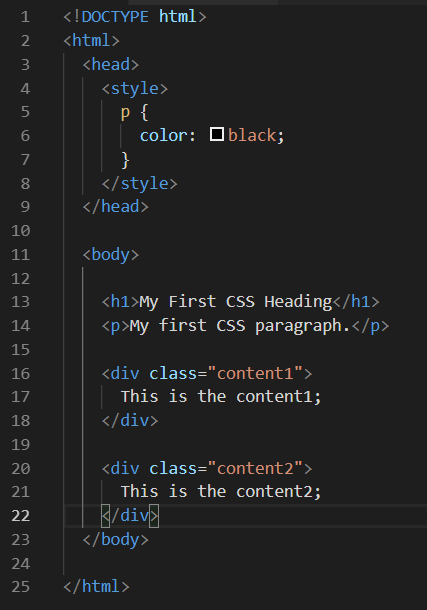
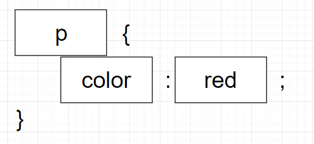
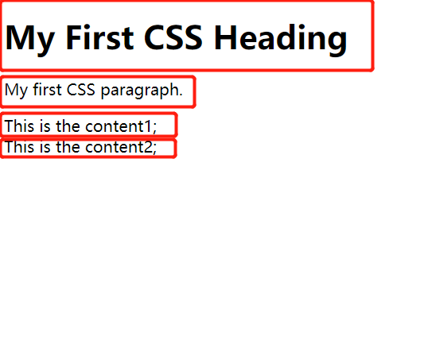
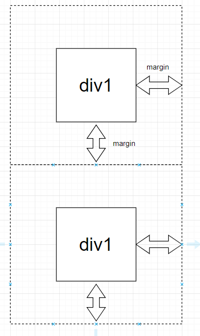

<a href="https://wes-chen.github.io/build-a-website/">Return to course home</a>

# CSS Basics

## What is CSS?

CSS stands for Cascading Style Sheets. It describes how HTML elements are to be displayed, and after we create the skeleton for our website using HTML, we write CSS code to make it beautiful. 

Without good CSS code the website may look weird.

 So now let's go through examples and dive into CSS!

## CSS: Basics
### Style Tags
Just like html code, like `<h1>title</h1>`, our CSS code is also contained inside a opening tag and a closing tag.

``

Typically, we put our `` element inside of the `<head></head>` element. By convention, we put anything we want to display like text, paragraphs, and images in the `<body></body>` tag, and we put `` in the `<head></head>` element. 

But, what does the code inside the `<style>` tags actually mean? So let's talk about the basic syntax of the CSS.

### The Basic Syntax
CSS code comprises some basic parts: the selector, the property name, and the value. Let's look at a diagram of it.

<ul>
<li>`p`: This is the <strong>selector</strong> we talked about just now. It means that, we are selecting all the elements with tag `p`. In addition to selecting by the name of the tag, we can also select by id or class, which is covered later in this lesson.</li> \
<li>`color`: This is the property of the p element that we want to modify. Here, we are saying that, we want to modify the "color" property of all elements with tag p. There are bunch of all other properties that you can use to make more complex modifications.</li>
<li>`value`: This is the value that we want to set our color property to. Here we are saying that we want to set the color to red. </li>
</ul>
It is important that, first, for each line of css code use write, we must put a semicolon `;` at the end. This tells your computer that you have finished one sentence and are beginning the next sentence; second, put all CSS code like `color: red;` inside of curly braces `{...}`. 

If your CSS code does not work as intended, for example, the paragraph does not turn red after you set the color to red, it is good to check if you used the syntax correctly.

### Challenge 1: create your first CSS code
Problem: Make the text inside of h1 tags green.

Here is the starter code: <a href="index.html">click<a/>. Create a new HTML file on your own computer, copy the code into it, and start messing around with it. 
 
## CSS: Selectors
In the previous section, we used "p" as the selector, so that every p in the page has a color of red. But what if we don't want every paragraph in the page to be red? In order to change one element specifically and without changing others, we use class or id to write CSS code.

### Select element by classes
Classes and ids are both like names: you give an element a name you like, and you select this element by this name. First, you give one element a class:

`
This is the content1
`

Write the `class=""` inside the first tag of the element. Notice that you need to put the class inside the quotes. 

Then, inside of the `<style>` element, select that class by `.content1`. Notice that here we begin with a dot `.` followed by the class name we just gave to the element we want to select. This is important and necessary.

`.content1 {
   font-size: 20px;
 }`
 
### Select element by classes
ids and class are both similar, but the most important difference, is the idea that `id` should be unique for each element. For example, each of you is an element, and all of you share one common class: `high-school-students`, but each of you have unique names, or at least unique student IDs. In short, `id` is more specific than `class` and you should use it when you just want to change some particular elements.

`
This is the content2/div>`

Write the `id=""` inside the first tag of the element. Notice that you need to put the id inside the quotes. 

Then, inside of the `<style>` element, select that id by `#content1`. Notice that here we begin with a pound `#` followed by the id we just gave to the element we want to select. This step looks similar the what we have for the `class`.

`#content1 {
   font-size: 30px;
 }`
 
### Challenge 2: use selectors
1. Go to your file and find these two `div`s inside the `body` tag. Try to give a `class` of `content1` to the first div, and give an `id` of `content2` to the second div. 

2. Go to the `style` tags. Make the text in the first div green, and the text in the second div gray. (Hint: use the `color` we just talked before).
 

## CSS: More on Styles
Since we have learned how to select different elements, it is time to know more about more properties that we can change in order to make our page look nicer. 

### Essential Font Styles
<ul>
<li>color: This determines the color of the text. By default you can see that the color is set to black. You can enter a wide range of colors, such as red, green, gray and so on.</li>
<li>font-size: This determines the size of the text</li>
<li>font-weight: This determines how thick, or heavy, that the text appears on the window.</li>
</ul>

### Essential Positioning
In HTML, different elemtents are like boxes that are piled vertically.

When you write text inside these elements, you have probably seen that there are actually whitespace around the text, so that if you put one element next to another element, there are some spaces between the texts of each element. The whitespace is due to two properties that each element have: `margin`, and `padding`:
<ul>
<li>margin: This determines the thickness of the whitespace outside of that element. 
    
 
 </li>
</ul>
### 
