<a href="https://wes-chen.github.io/build-a-website/">Return to course home</a>

# Bootstrap

## What are we going to learn about today?

Today we will be learning about Bootstrap, and how to incorporate it into our own website.

## What is Bootstrap?

[Bootstrap](https://getbootstrap.com/) is a popular front-end component library that makes life a lot easier for people who want to make websites. It is a framework, and it can help you in the following ways ([source](https://www.taniarascia.com/what-is-bootstrap-and-how-do-i-use-it/)):

-   Prevent repetition between projects
-   Utilize responsive design to allow your website to adapt to various screen sizes - mobile, desktop, and everything in between
-   Add consistency to design and code between projects and between developers
-   Quickly and easily prototype new designs
-   Ensure cross-browser compatibility

It is a lot easier to use Bootstrap's components to build a website rather than have to write all the CSS of your website yourself.

Bootstrap's [Get Started Page](https://getbootstrap.com/docs/4.3/getting-started/introduction/) seems a little daunting already, but we'll only be focusing on using their prebuilt components that don't require any JavaScript.

## Core Concepts

### The Grid

[The grid](https://getbootstrap.com/docs/3.4/examples/grid/) is one of the most crucial concepts in using Bootstrap. Basically, you can divide a row into 12 "subunits" that you can combine to divide things evenly. You can divide your row in half, or in thirds, or in quarters with ease.

### Using Bootstrap components

Basically, we will use classnames to call our bootstrap components very easily.

### Overriding Bootstrap

TODO

## PRE-CHALLENGE #01: Starting fresh.

We're going to be completely honest.

Having all these colors and random pictures aren't very suitable for a professional website that you will use to present your extracurricular activites and class projects.

Let's go ahead and start from a blank slate so we can build a website that you actually can present to your teacher and other friends. However, we won't make you delete your past website. Instead, we will rename your old `index.html` into something else, then make a new `index.html`.

Go ahead and open your File Explorer, then find your way towards where your `index.html` is located. This will probably through `Documents -> GitHub -> [username].github.io`.

At the top of the File Explorer, go ahead and click `View` then check-mark `File name extensions`. If you complete this step (or have completed it), then you should able to see the `.html` portion for `index.html`.

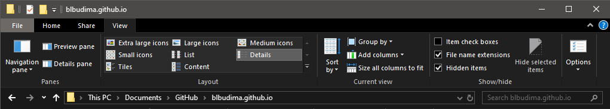

You should see `index.html` once you navigate to your website repository. It's alright if you see other files as well - we will only focus on `index.html`:

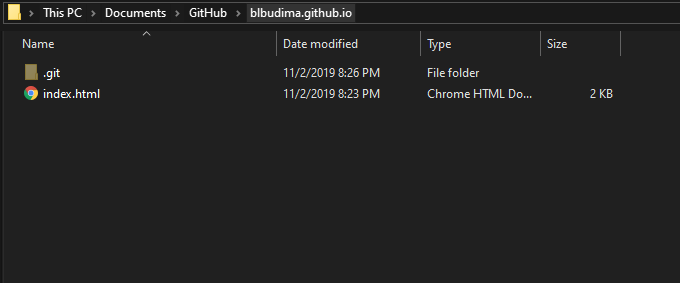

Once you find `index.html`, go ahead and right-click it and select `Rename`. Go ahead and rename it to `other.html`.

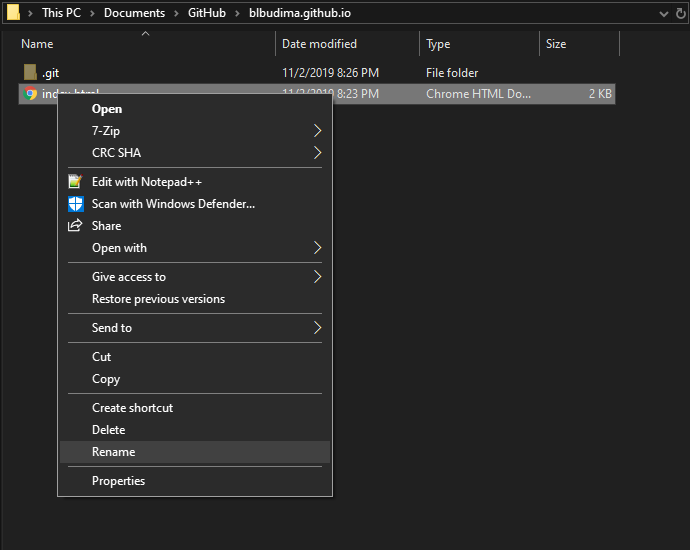


Right-click an empty area, then select `New -> Text Document`. Go ahead and name this new file `index.html`. If asked if you want to change it, select `Yes`.


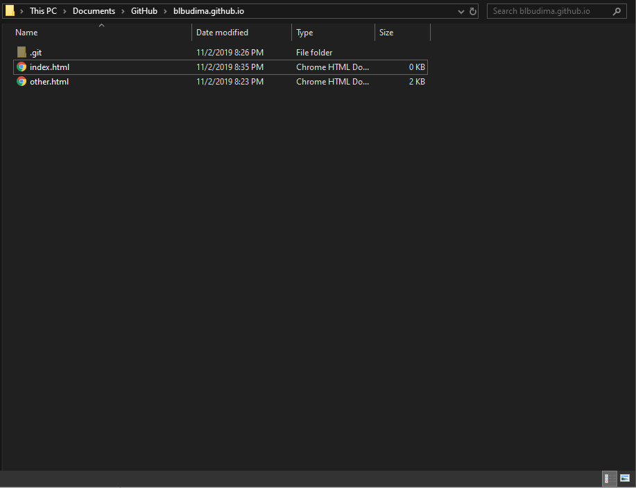

Now that you have a fresh `index.html` to work off, please right-click `index.html`, click `Open with -> Atom` and copy the code in the next image into your new `index.html`. Please replace `<title>` with your own name!

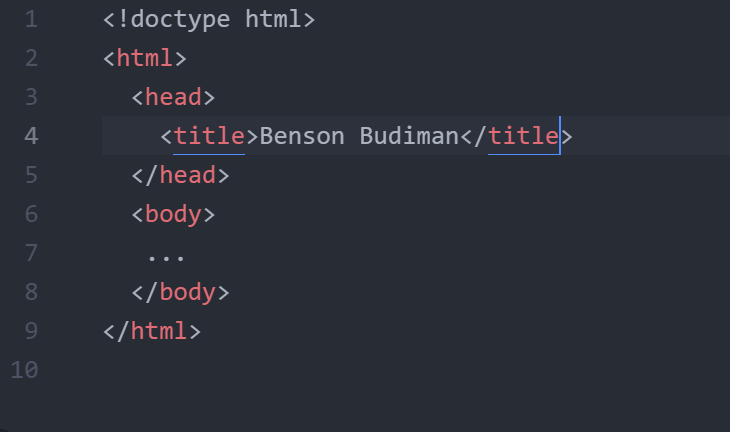

</br>
</br>
</br>

## PRE-CHALLENGE #02: Add Bootstrap to your website (index.html).

Before you can add Bootstrap components to your website, you must first load Bootstrap into your `index.html` as a stylesheet. You can load Bootstrap by copy-pasting their stylesheet `<link>` into your `<head>` before all other stylesheets.

```html
<link rel="stylesheet" href="https://stackpath.bootstrapcdn.com/bootstrap/4.3.1/css/bootstrap.min.css" integrity="sha384-ggOyR0iXCbMQv3Xipma34MD+dH/1fQ784/j6cY/iJTQUOhcWr7x9JvoRxT2MZw1T" crossorigin="anonymous">
```

Go ahead and paste the entire `<link>` above into your `<head>` tag of your `index.html`.

If you have done it correctly, then when you open up your `index.html` in Atom, your current `index.html` should look something like this:


</br>
</br>
</br>

## CHALLENGE #01: Center a image, name and description with Bootstrap.

From starting fresh, your `index.html` file should look something like this now:


From here, let's go ahead and set a picture as an ``, my name as a `<h1>` and my description as a `<p>`. I have chosen a picture of UCSD's Geisel Library for my ``, but please feel free to pick anything as long as it is appropriate. Once you selected a `src` for your image, go ahead and give it a `class="img-thumbnail"` and a `width="200px"`.

Giving it the class of `img-thumbnail` will use Bootstrap to give your image a rounded border around it.

Your `index.html` file should look something like this now:

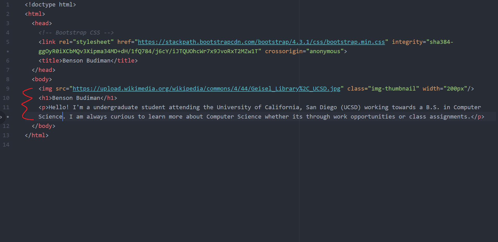

Afterwards, we want to surround the ``, `<h1>` and `<p>` HTML tags with a `<div>` tag. In other words, we will have a total of 3 `<div>` and `</div>` pairs in our `index.html`. Once we have done that, we will want to surround the entire inner-body of `<body>` with a `<div>`, bringing our total of `<div>` and `</div>` pairs to 4.

If you have followed these steps correctly, your `index.html` file should look something like this now:

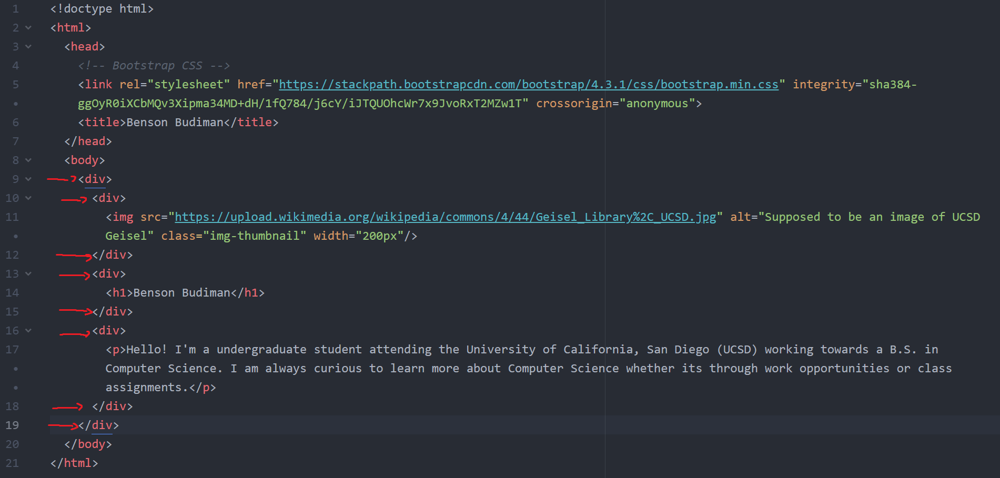

Once you have all your `<div>` in place, please give your first `<div>` a `class="container"`. For the rest of the three `<div>`, please give them a `class="row justify-content-md-center"`.

If you have followed these steps correctly, your `index.html` file should look something like this now:

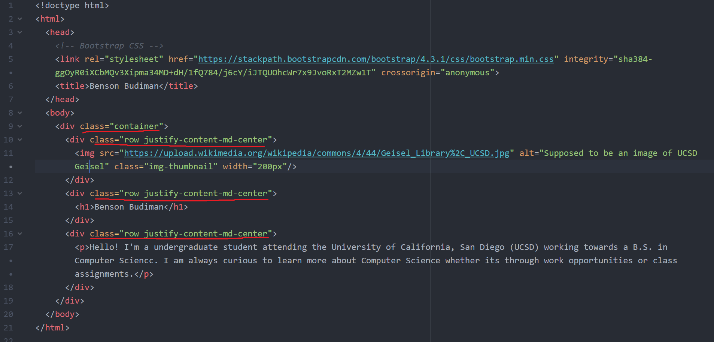

Once you completed all these steps, double-clicking your `index.html` and opening it in Google Chrome should show something like this:


If you are able to see something similar to above, then that means you are able to use Bootstrap to center your HTML content! If you are satisfied with your results, then go ahead and open up GitHub Desktop to `commit` and `push` your changes to your website online!

</br>
</br>
</br>

## CHALLENGE #02: Add two columns for your class project and other experiences with Bootstrap.

Now that your `index.html` has a picture, your name and your description, let's go ahead and create two columns so that we can later add your class projects and your other experiences.

Within your `index.html`, look for `</body>`, the closing tag for `<body>`. Right above `</body>`, go ahead and add a `<div>`, then give it a `class="container"`.

If you have followed these steps correctly, your `index.html` file should look something like this now:

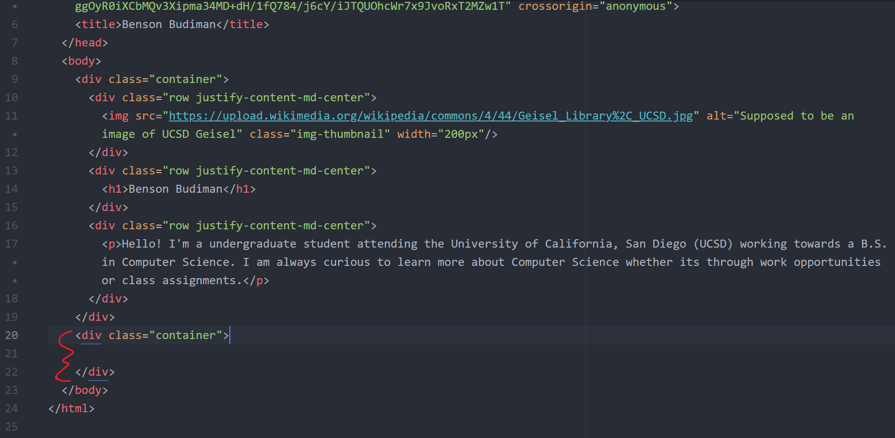

Within the new `<div>` with a `class="container"`, create another `<div>`, then give it a `class="row"`.

If you have followed these steps correctly, your `index.html` file should look something like this now:


Within the new `<div>` with a `class="row"`, create two more `<div>`, and give them a `class="col text-center"`.

If you have followed these steps correctly, your `index.html` file should look something like this now:

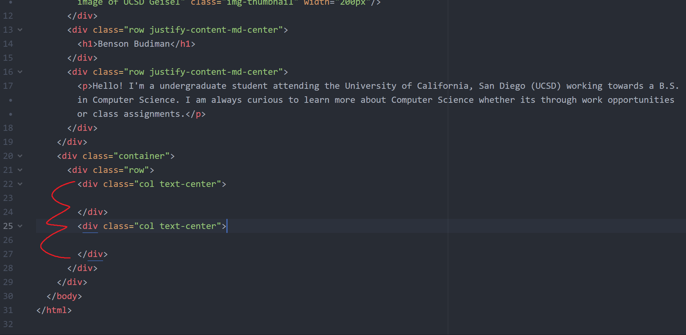

Within the two new `<div>` with a `class="col"`, add a `<h2>` for your class projects within one `<div>`, then add another `<h2>` for your other experiences within the other `<div>`.

If you have followed these steps correctly, your `index.html` file should look something like this now:


Once you completed all these steps, double-clicking your `index.html` and opening it in Google Chrome should show something like this:

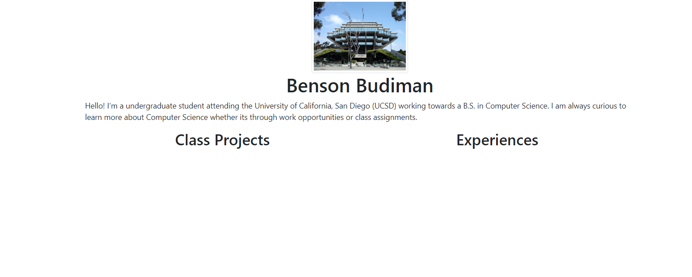

If you are able to see something similar to above, then that means you have succesfully created columns using Bootstrap! If you are satisfied with your results, then go ahead and open up GitHub Desktop to `commit` and `push` your changes to your website online!

</br>
</br>
</br>

## CHALLENGE #03: Add cards to your class projects and other experiences using Bootstrap.

Now that your `index.html` has two columns ready for you to add your class projects and other experiences, we can go ahead and add cards for those columns!

Underneath your `<h2>` for class projects, create a new `<div>`, then give it a `class="card"`. Within that new `<div>` with `class="card"`, create another `<div>`, then give it a `class="card-body"`.

If you have followed these steps correctly, your `index.html` file should look something like this now:

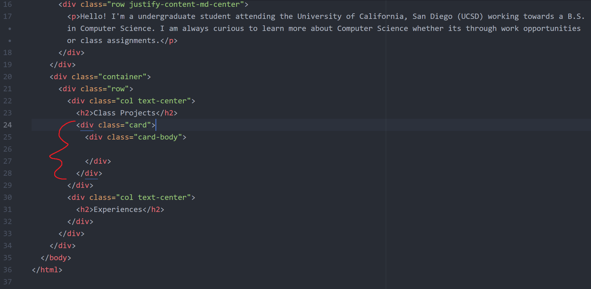

Within your `<div>` with a `class="card-body"`, add a `<h5>` with a `class="card-title"`. Go ahead and put the title of a class project with the `<h5>` tags. For my purpose, I will put the build-a-website title.

If you have followed these steps correctly, your `index.html` file should look something like this now:


Underneath the `<h5>` tag, add a `<p>` with a `class="card-text"`. Go ahead and put the description of a class project with the `<p>` tags. For my purpose, I will put description of the build-a-website program.

If you have followed these steps correctly, your `index.html` file should look something like this now:


If you double-click your `index.html` and open it in Google Chrome should show something like this:

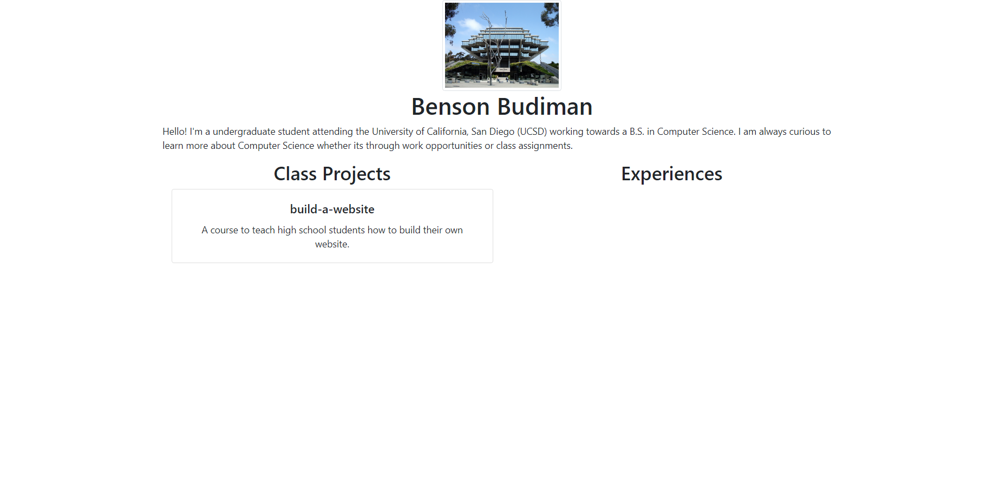

If you are able to see something similar to above, then that means you have succesfully created a card using Bootstrap! Let's go ahead and add a few more cards to our columns.

I've gone ahead and added two cards to my experiences column.

If you are able to add two cards to your experience column, your `index.html` file should look something like this now:


Once you completed all these steps, double-clicking your `index.html` and opening it in Google Chrome should show something like this:

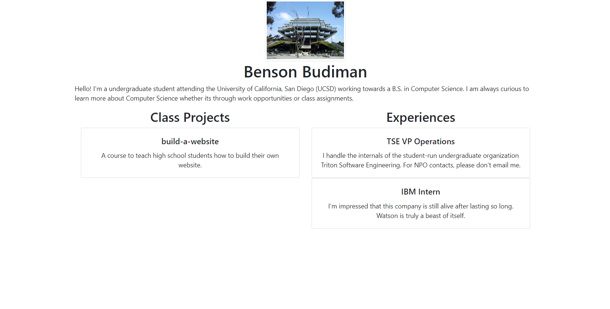

If you are able to see something similar to above, then that means you have succesfully created cards using Bootstrap! Go ahead and create more cards if you have more class projects and other experiences you want to talk about. If you are satisfied with your results, then go ahead and open up GitHub Desktop to `commit` and `push` your changes to your website online!

## Survey time!

<a href="https://docs.google.com/forms/d/e/1FAIpQLSdgsWcI1Y_uI8YAd3po9IOmRa-PUIsjm1HdMbU2f3HAsMn_Zg/viewform?usp=sf_link"><button>Lesson 5 Survey</button></a>
