<a href="https://wes-chen.github.io/build-a-website/">Return to course home</a>

# Add Pages and Host Static Files

So far, we taught you how to use HTML, CSS, and Bootstrap to build your own personal website. We also made you create two main `html` files - `index.html` and `other.html`.

Check that you have an `index.html` and an `other.html` in your `Documents->GitHub->[username].github.io` folder on your computer:

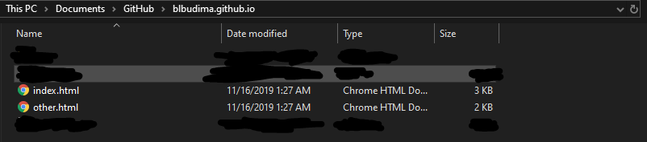

If you double-click your `index.html`, then it will open it up in Google Chrome. You may have to right-click `index.html` and click `Open with->Google Chrome`. It should look something like this:

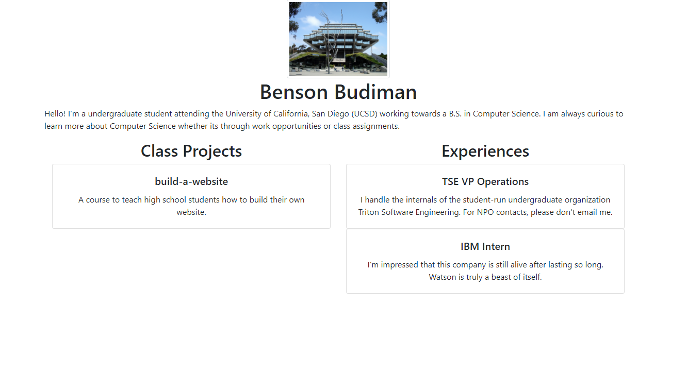

Your `other.html` should have any personal content that you previously made.

If you do not have an `index.html` or an `other.html`, then you should look back at the [previous lessons](https://wes-chen.github.io/build-a-website/){:target="_blank"} to make sure you have those two files created.

Once you have an `index.html` and an `other.html`, let's move forward!

## PRE-CHALLENGE #01: Add Pages: linking your `index.html` to your `other.html`

You are probably (or probably aren't) thinking about a way to visit your old website - your `other.html`. Although `other.html` exists in your website folder, going to your website online will only show `index.html`. However, we can provide a solution for that!

Let's create a link to access your `other.html` from your `index.html` by adding `other.html` as a project (or an experience - up to you).

#### **PROCEDURE**:

0. Ensure that `other.html` is in the same folder as `index.html`. This makes the link possible and easy.

1. Let's start off at our `index.html` file. Open it up in Atom, and look for the `<h2>` line with "Class Projects" as its text.

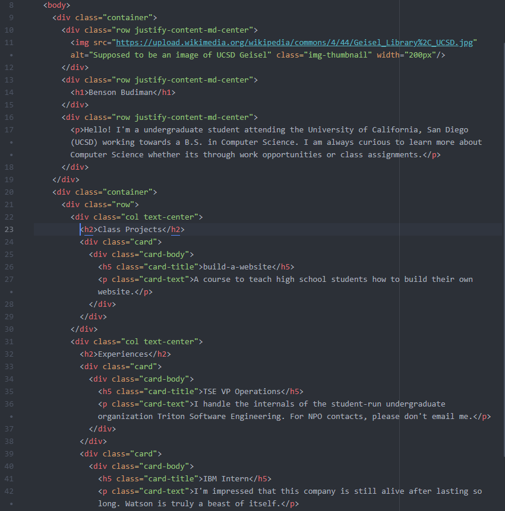

2. Let's create a new card under our "Class Projects" column. Within the new card, let's place a `<h5>` (heading) element while giving it a `class="card-title"`. Do not put any text within it just yet.

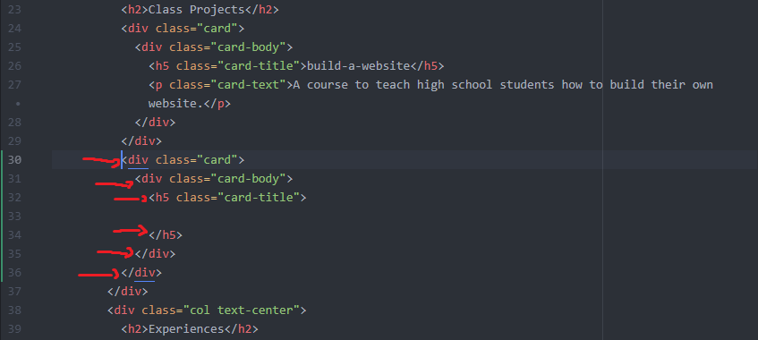

3. Let's create an `<a>` (anchor) element within the `<h5>` element to create a link to our `other.html`. This will be our `card-title`, so make sure to name it something reasonable. Since `other.html` is in the same folder as `index.html`, you won't need to have some long or fancy URL to link it - you can just use `other.html`!

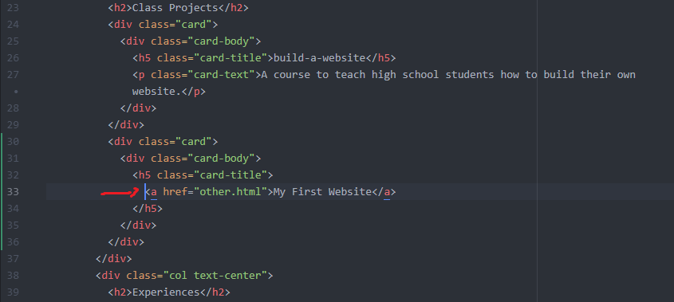

4. Let's add our `
` (paragraph) element to give a description to our link. This will be the `card-text`.

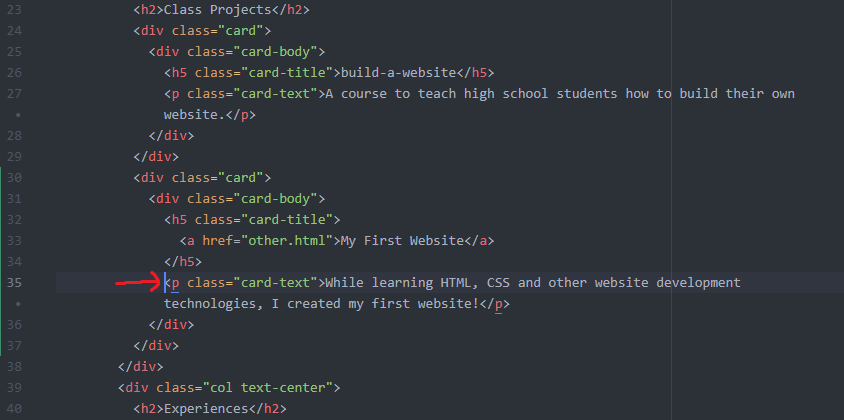

5. Once you completed all these steps, double-clicking your `index.html` and opening it in Google Chrome should show something like this:

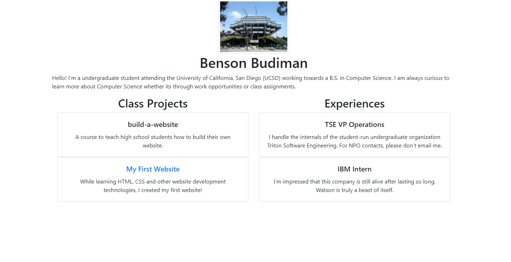

Congratulations - you successfully linked your homepage (`index.html`) to your first website (`other.html`)!

If you want to link any other `.html` files from your homepage (`index.html`), you first need to make sure that the `.html` is within your website folder (`[username].github.io`) before attempting to link it.

#### If you are satisfied with your results, then go ahead and open up GitHub Desktop to `commit` and `push` your changes to your website online!

## PRE-CHALLENGE #02: Host Static Files: adding your own picture(s) to your website

Using the same logic as adding a `.html` file to your website folder and linking it from your homepage, we can also add an image file (`.png`, `.jpg`, etc.) to your website folder and add it to your website!

Looking at my `index.html` image from the previous section, let's say I want to replace the picture of UCSD's Geisel Library with a picture of myself.

Here is a method to add your own picture(s) to your website.

#### **PROCEDURE**:

1. Find a picture that you want to add to your website, then add to your project folder. For example, I want to put a picture of myself on my homepage, so I will add an image file of myself to the folder. My image file is called `profile_picture.jpg`. ***Make sure that you know the file extension of your image (e.g. `.png`, `.jpg`, etc.).*** For example, I know that my image is a JPG file because it ends in a `.jpg` and that the type is `JPG File`.

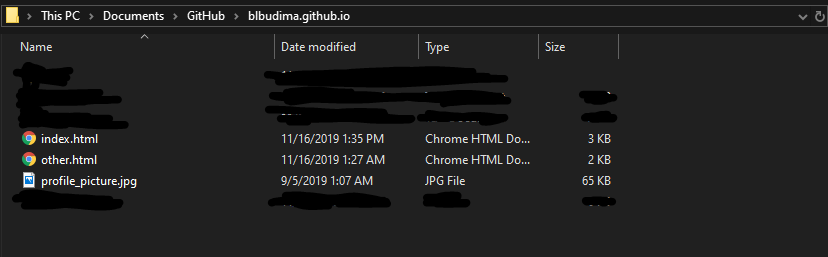

2. Open up the `.html` file that you want to add the image to. For example, I want to add my profile picture to my homepage (`index.html`), so I will open up `index.html` in Atom.

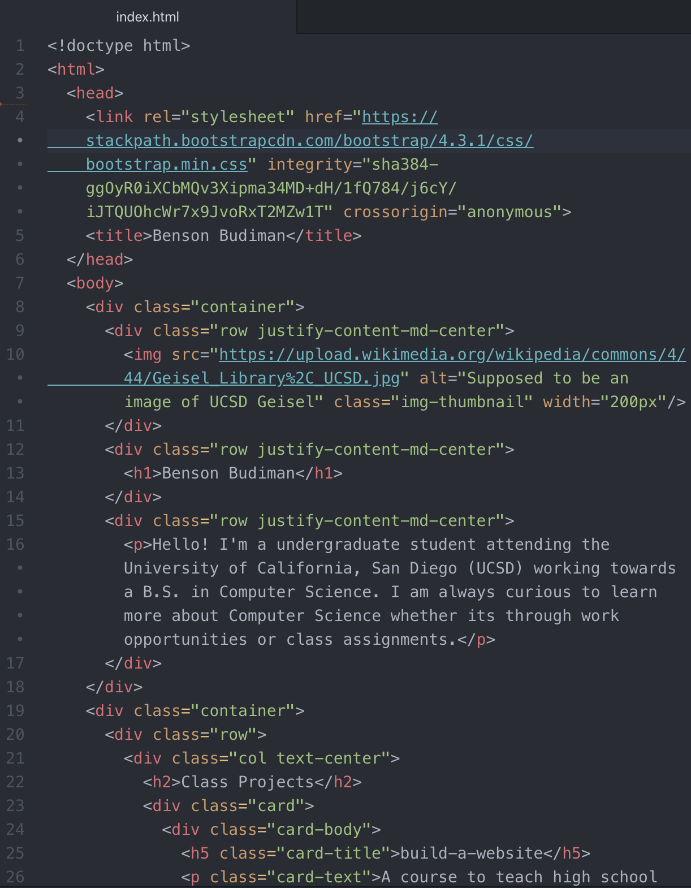

3. Find the `` (image) element (or create the `` element) where I want my profile picture. For example, I want to replace the picture of UCSD's Geisel Library with my own profile picture, so I look for that specific `` element.

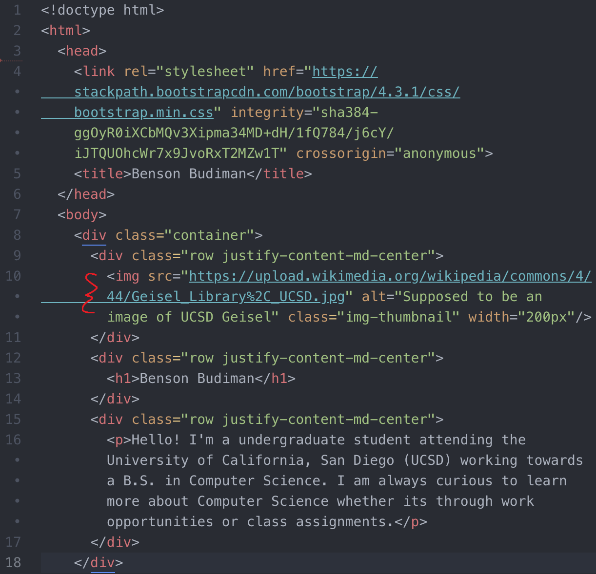

4. Replace the `src=""` with the name of your file. For example, I will replace `src="https://upload.wikimedia.org/wikipedia/commons/4/44/Geisel_Library%2C_UCSD.jpg"` with `src="profile_picture.jpg"`.

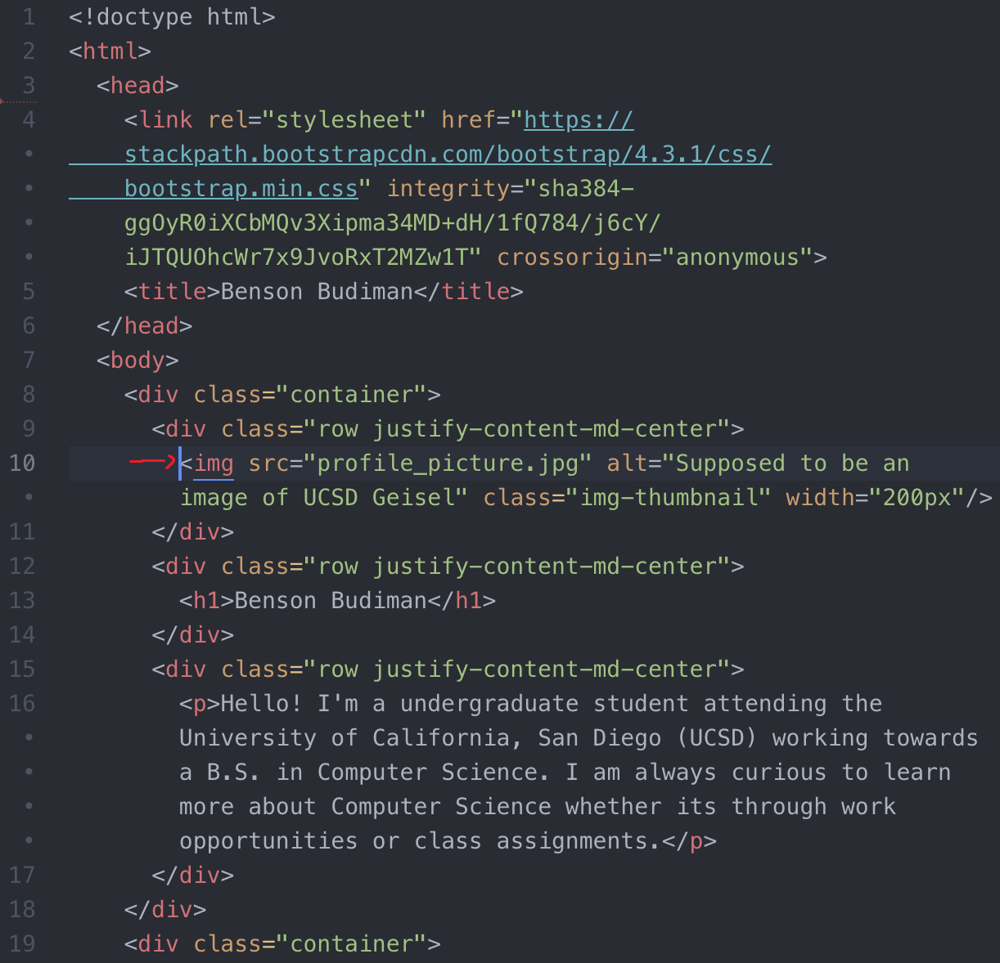

5. Once you completed all these steps, double-clicking your `index.html` and opening it in Google Chrome should show something like this:

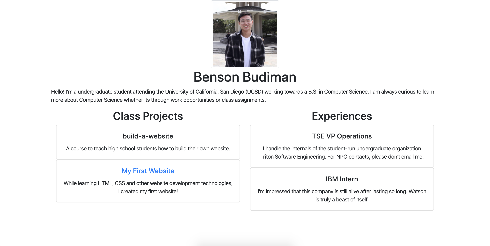

The picture of UCSD's Geisel Library has been replaced with my picture!

If you manage to host your own image, then congratulations - you successfully hosted a picture on your website!

If you want to add any other image files to your website, then you first need to make sure that the image file is within your website folder (`[username].github.io`) before attempting to add it as a `src`.

#### If you are satisfied with your results, then go ahead and open up GitHub Desktop to `commit` and `push` your changes to your website online!

## CHALLENGE #01: Finish the research project template!

For this lesson, we will be working towards adding more research projects to your home page.

However, before we add any projects to your home page, you first have to create them (in the form of a `.html` file)!

Each of your research projects will cover the following topics:

- Component 1: Research a Problem
  - Element A: Identification and Justification of the Problem
  - Element B: Documentation and Analysis of Prior Solution Attempts
  - Element C: Presentation and Justification of Solution Requirements
- Component 2: Design
  - Element D: Design Concepts Generation, Analysis, and Selection
  - Element E: Application of STEM Principles and Practices
  - Element F: Consideration of Design Viability
- Component 3: Prototype and Test
  - Element G: Construction of a Testable Prototype
  - Element H: Prototype Testing and Data Collection Plan
  - Element I: Testing, Data Collection, and Analysis
- Component 4: Evaluation of Project and Process
  - Element J: Documentation of External Evaluation
  - Element K: Reflection on the Design Project
  - Element L: Presentation of the Designer's Recommendations
- Component 5: Reflection and Presenting the Design Process
  - Element M: Presentation of Project and Project Portfolio
  - Element N: Writing like an Engineer

### ***Your challenge is to finish our provided template with your OWN research project information***.

#### **PROCEDURE**:

To help you begin working on the topics related to your research projects, **we have provided a template for you to use**.

The template contains a skeleton for "Component 1: Research a Problem" and all the elements within that component.

Please right-click this [link](template.html) and click `Save as...`. Go ahead and save `template.html` to your website folder (`[username].github.io`). If you open your website folder in Atom, then it should look something like this:

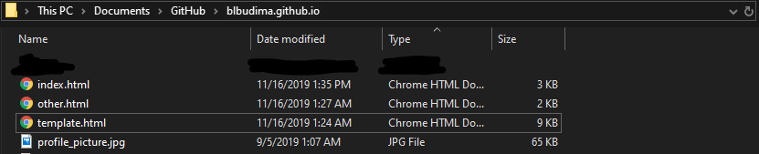

If you double-click `template.html` to open the file up in Google Chrome, then you should see the following website:

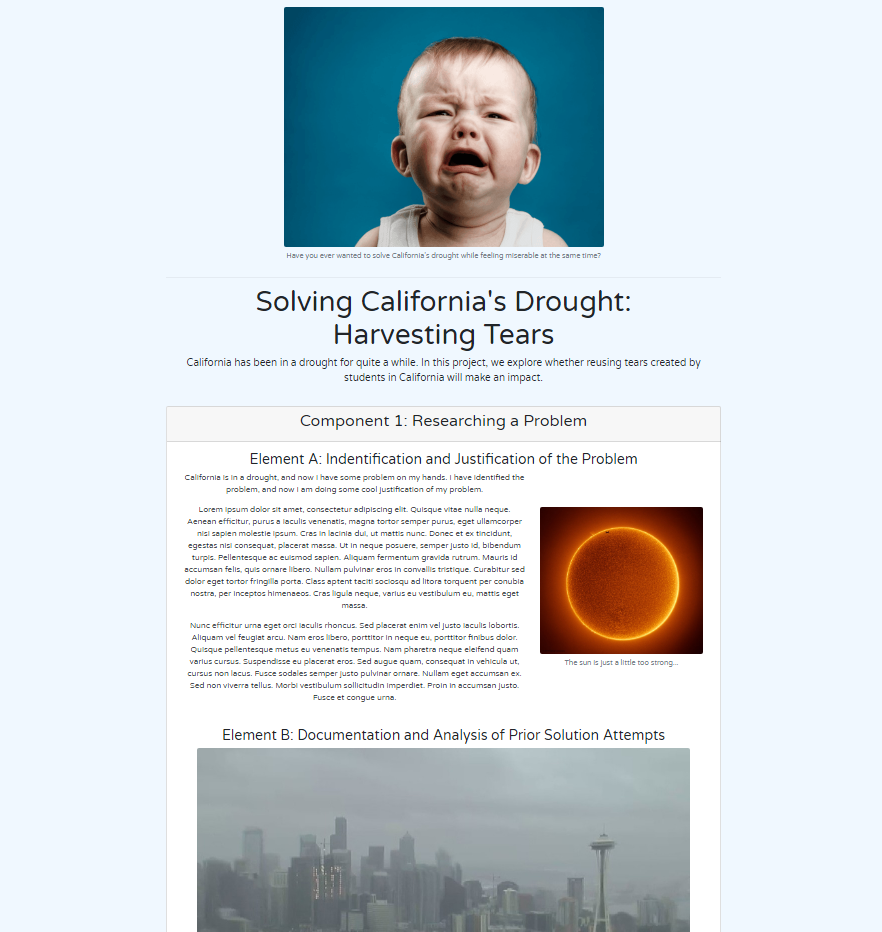

If you open `template.html` in Atom, then you should see something similar to the following code:

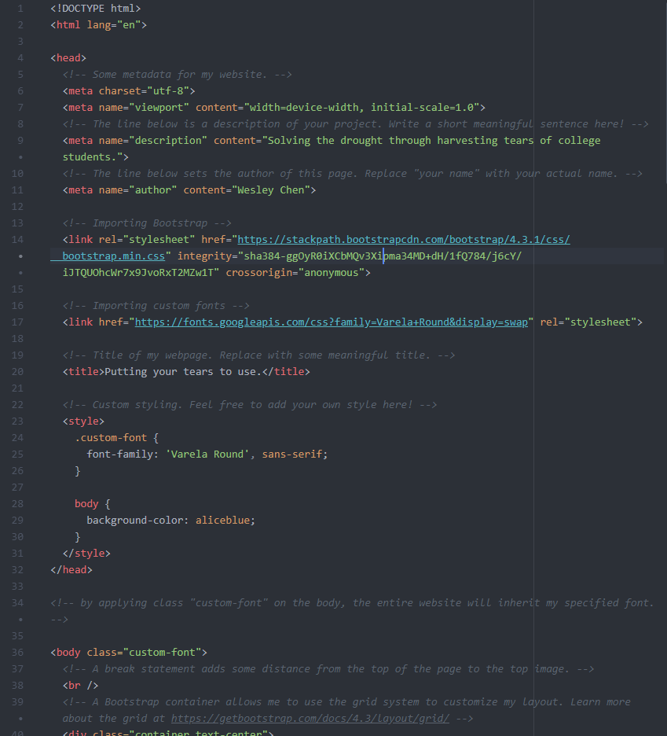

#### The first step is to read through the code!

***PLEASE TAKE YOUR TIME TO READ THE COMMENTS IN THE CODE***.

The comments will help you out to figure out what each line of the `template.html` file does.

There will be some spots where you will be ask the current information with your own personal information, so keep a sharp eye for those!

***Each research project component will be a Bootstrap card for simplicity sake***.

Make sure you are able to identify the parts (or `
`) that create the `card-header` for "Component 1: Researching a Problem", the `card-body` where you put a `container` for each your elements. We also use Bootstrap `col` and `row` to help organize our data, so if you are not sure how to use `col` and `row`, then you can find more information [here](https://getbootstrap.com/docs/4.3/layout/grid/){:target="_blank"}.

As you look through the code, if you encounter some code that you do not understand, ***please use Google to your advantage***! Answers from Google will probably explain your problems a lot better than we ever could.

#### Once you finish reading through the code, please make the appropriate changes to add your own information to the template!

This would require but not limited to:

- changing the metadata to be relevant to you
- changing the research project image/title/description
- changing or adding more information to each element
  - text, images, lists, tables, etc.

#### Once you finish making the appropriate changes to the template, the next step will be adding the rest of the components and elements to your website.

Looking at the outline of topics above, you will need to add Components 2 through 5 as well as all the Elements contained with those Components.

If you are confused on how to add more components to this `template.html`, then take a good look within the code where we add the `<h2>` of the components within a certain `
`.

#### Once you finish adding all the components and elements to your research project website (`template.html`), then let's finally change the file name to something more appropriate.

For example, if my research project was related to solving drought, then I would rename my `template.html` to `solving_drought.html`. My project folder should look something like this:

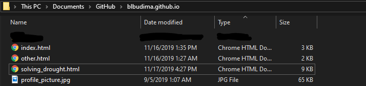

#### If you reached this line, then congratulations - you finished a research project page! Let's add the research project page to your homepage (`index.html`).

## CHALLENGE #02: Add research projects to your homepage!

Now that you finished your research project page (`.html` file), or perhaps if you have finished multiple of them, your challenge is to add more research projects to your homepage!

For example, let's say I want to add my `solving_drought.html` as a research project.

Opening up `index.html` in Atom should show something like this:

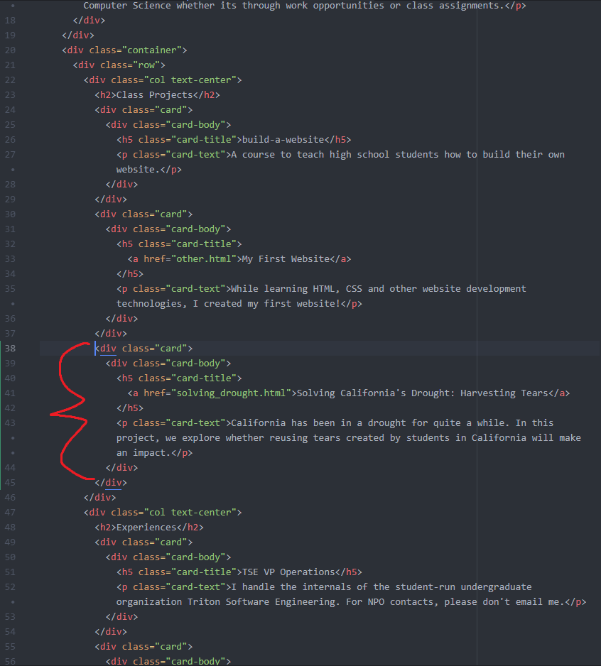

Opening up `index.html` in Google Chrome should show something like this:

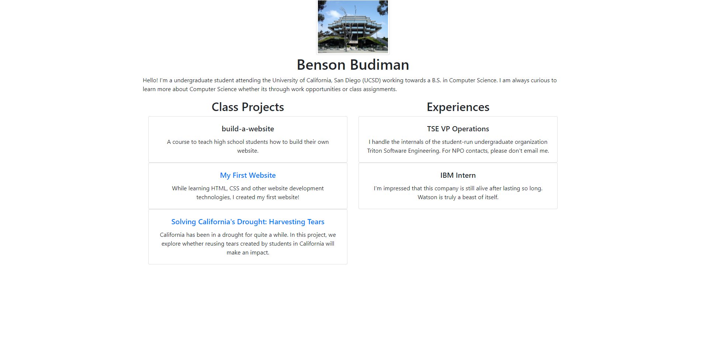

Clicking "Solving California's Drought: Harvesting Tears" would redirect me to my research project page!

If you have something similar to what is on here, then congratulations - you added your own research project(s) to your website!

#### If you are satisfied with your results, then go ahead and open up GitHub Desktop to `commit` and `push` your changes to your website online!
